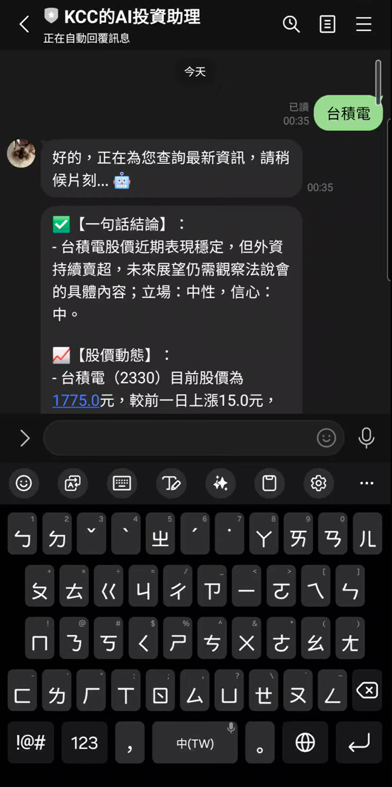

# Finance LineBot — AI 投資助理

本專案是一個台股情境的 LINE Bot，整合 FinMind 股價、FinMind 新聞與 Google News RSS，並透過 GPT 產生分析回覆。重點是「可驗證（Grounded）的 RAG」：回覆中的重點會以 [n] 對應到來源清單，並由程式自動整理出「🔗【引用來源】」，避免模型漏列或亂列引用。此外，系統會從合併後的候選新聞中挑選 Top3 抓取全文摘錄，提供更扎實的證據支撐。

---

## 完整 Demo 影片（YouTube）

[Watch on YouTube](https://youtu.be/fiRyKwqtMeg)

<a href="https://youtu.be/fiRyKwqtMeg">
  
</a>

**Quick Usage（輸入範例）**
- 公司名：`台積電`
- 代號：`2330`
- 公司名 + 問題：`高力會跌嗎`
- 代號 + 問題：`8996會漲嗎`
- 錯字測試（Fail-safe）：`台積店`

---

## 核心特色

* **Grounded RAG / 可驗證引用**

  * RAG context 會列出新聞 **[1]..[8]**（來源清單仍含 `title/source/date/url`）
  * 回覆正文要求用 **[n]** 引用；若資料不足必須誠實說「資料不足，無法判斷」

* **引用來源清單由程式保證一致（Deterministic）**

  * `summarize.py` 會從回覆正文抽取實際使用的 **[n]**
  * 再回到 context 的來源清單查表，生成「🔗【引用來源】」
  * 引用來源輸出統一格式：**標題 | 來源 | YYYY/MM/DD**（不顯示時間、不顯示 URL）
  * 若模型引用不存在的編號，系統會略過該編號並記錄 warning，不會輸出錯誤來源。

* **URL 正規化 & 無用連結過濾**

  * 先正規化 URL（http→https、格式檢查），再過濾首頁/無效連結
  * 首頁/無效連結直接顯示「無連結」
  * 避免引用無意義 URL（例如只有首頁）

* **多來源新聞互補**

  * FinMind + RSS 各抓最多 8（候選最多 16），再進行合併
  * 合併策略：各取 4、不足互補、去重後 `cap=8`

* **Lazy Full-Text Top3**

  * 從合併後（`cap=8`）的候選新聞挑最相關 Top3，抓全文並抽取 1–2 段關鍵摘錄
  * Top3 選文（中性）：以公司名/代號做標題輕量 rerank，避免被使用者問法（如「為什麼跌/漲」）帶偏
  * 摘錄擷取：先用空行切段落找最相關段；若都沒命中則用滑動視窗在全文中補抓片段，並且依照使用者問題當作關鍵字來做擷取。
  * 讓模型「有證據可讀」而不是只看標題
  

* **多層快取 + 背景刷新**

  * 股票清單長期快取、股價短 TTL、新聞中 TTL
  * 背景執行緒自動更新

* **Token 用量與成本估算 LOG**

  * 印出 prompt/completion/total tokens
  * 成本以程式內建的近似匯率估算（僅供參考）。

---

## 系統運作流程（高階 Pipeline）

```text
使用者 (LINE)
   |
   v
+------------------+
| app.py (Webhook) |
+------------------+
   |
   v
+------------------------------+
| rag.py (Build Context / RAG) |
+------------------------------+
   | (1) 股票辨識：smart_identify_company()
   | (2) 股價：get_price_with_cache()
   | (3) 新聞：FinMind + RSS 各抓最多 8
   | (4) 合併：merge_news()
   |    - 各取 4，不足互補
   |    - 去重後 cap=8
   | (5) URL 正規化 / 首頁過濾 => 無連結
   | (6) Lazy Full-Text Top3：
   |    - 由合併後（cap=8）的候選挑最相關 3 則
   |    - 抓全文並抽 1–2 段摘錄
   | (7) 組裝 Grounding Context：
   |    - [1]..[8] 來源清單（title/source/date/url）
   |    - Top3 摘錄沿用相同 [編號]
   |
   v
+------------------------------+
| summarize.py (GPT 生成回覆)  |
+------------------------------+
   | - 嚴格引用：[n]
   | - 不能捏造具體事實；可用一般金融常識（需標示一般情況）
   | - 資料不足就說資料不足
   | - LOG：tokens + 成本估算
   |
   v
回覆 LINE 使用者
```

---

## RAG Grounding 設計（為什麼可信 / 為什麼不像「亂講」）

### (1) Context 一定會列「可引用來源清單」

* `rag.py` 組 context 時，會列出新聞來源清單 **[1]..[8]**，格式如下：

```text
[新聞來源 (請用 [編號] 引用)]
[1] 標題 | 來源 | 日期
[2] ...
註：context 內可能含 URL 與時間資訊，但最終回覆的「🔗【引用來源】」會統一轉為 YYYY/MM/DD，且不顯示 URL / 時間。
```

* 這讓模型在描述事件、結論、或原因解讀時，可以回指到明確來源。

### (2) Lazy Full-Text Top3 提供「內文證據」

* 僅對最相關 Top3（以公司名/代號做中性標題 rerank）抓全文；抓到全文後，再依使用者問題（user_query）抽 1–2 段最相關摘錄：

```text
[全文摘錄 (Top3，仍請用相同 [編號] 引用)]
[3] 摘錄1: ...
[3] 摘錄2: ...
```

* **重要特點：摘錄沿用相同 [編號]**
  => 模型引用 **[3]** 同時對應「來源條目」與「全文摘錄」。

### (3) 自動降級（Fallback）機制

* 若遇到付費牆 / 反爬 / JS 動態渲染導致全文抓取失敗：

  * 系統仍可保留標題級 evidence（[1]..[8]）
  * 模型必須誠實表達「資料不足，無法確認」

### (4) URL 正規化與「無連結」

* 針對首頁 / 無效連結（例如只有 domain 首頁），會直接顯示「無連結」
  避免引用「無意義 URL」造成使用者困惑。

### (5) 引用來源表由程式生成（避免模型漏列）

* 模型在正文中會標註 **[n]** 引用
* `summarize.py` 會自動掃描回覆中實際出現的 **[n]**，並從 context 的來源清單回填成：

```text
🔗【引用來源】：
- [n] 標題 | 來源 | YYYY/MM/DD
```

* 目的：確保「正文引用」與「引用來源清單」永遠一致，避免 LLM 漏列或列錯。

---

## 快取機制（Cache）與注意事項

### (1) retrievers/cache.py（資料源快取）

* 股票清單：長 TTL（背景刷新同步 `STOCK_MAP`）
* 股價：短 TTL
* 新聞：中 TTL
* 背景執行緒：定期刷新，避免每次都打 API

### (2) rag.py（查詢結果快取：Query Cache）

* `rag.py` 內建「查詢結果快取」（預設 120 秒）
* 若你在短時間內用相同 query 測試（例如同一句「台積電」），可能會直接回傳快取的舊 context。

測試建議：

* 修改 RAG/URL 過濾/全文擷取邏輯後，若結果看起來沒更新：

  * 重新啟動 `python app.py`（清空記憶體快取）
  * 或暫時縮短 `CACHE_DURATION_SECONDS` 方便測試

### (3) retrievers/fulltext.py（Full-Text 快取）

* 內建 1 小時 in-memory cache（同一 URL 不重抓）
* 若網站有反爬/付費牆/動態渲染導致抓不到全文：

  * 屬正常現象，系統會 fallback 只用標題級 evidence

---

## summarize.py 回覆規範（金融場景護欄）

### (1) 立場與信心（Evidence-based）

* 回覆會輸出：

  * 立場：偏多 / 中性（觀望） / 偏空
  * 信心：高 / 中 / 低
* 規則採「證據門檻」：

  * 偏多/偏空需同向證據 >= 2，且至少 1 點來自全文摘錄；證據不足則中性或資料不足
  * 信心採嚴格門檻：全文摘錄不足、來源少或衝突時傾向低，並回覆資料不足

### (2) 股價動態（不使用新聞引用）

* 股價動態只根據 context 的 **[股價資訊]**（FinMind API）輸出
* 本段也在 prompt 中要求不引用使用新聞引用 **[1]..[8]**

### (3) 引用規則（必須遵守）

* 凡涉及「具體事實（數字、日期、事件、引述）」或「對公司近況的判斷/原因解讀」
  都必須在句尾標註引用編號，例如：**[1]** 或 **[2][5]**
* 引用編號只能使用 context 中出現的 **[1][2]...[8]**；不得編造不存在的編號。

### (4) 外部知識的使用方式（重要）

* 不得使用外部知識去捏造「具體事實」。
* 允許使用一般性的金融常識做「通用解釋/風險提醒」，但需清楚標註為「一般情況」，不得當作資料已證實的事實。

### (5) 資料不足處理

* 若 context 沒有足夠資訊支撐某個結論，必須直接寫：
  **「資料不足，無法判斷。」**
  並說明缺少什麼資訊（例如：需要內文/數字/法說細節）。

### (6) 風格與安全界線

* 不提供明確買賣建議、目標價或進出場點；
  僅做資訊整理、可能原因（需標註不確定）與風險提示。

### (7) 固定免責聲明

* 回覆最後必須附上：
  **（僅供參考，不構成投資建議）**

### (8) Token/成本 LOG

* 每次回覆後印出 prompt/completion/total tokens 與預估成本（台幣）。

---

## LOG 範例（節錄）

```text
[RAG/Query] 🚀 收到使用者查詢：「台積電」
[RAG/Identify] ✅ 完全命中 STOCK_MAP → 台積電 → 2330
[RAG/Price] 💹 查詢股價 → 2330
[RAG/News] 🗞️ 開始抓取新聞 → FinMind + Google RSS
[RAG/NewsMerge] ✅ 合併完成，共 8 則。
[RAG/Context] ✅ 組裝完成，共 8 則新聞。
LOG: Token 使用情況 -> prompt=..., completion=..., total=...
LOG: 預估成本 ≈ ... 元台幣
```

---

## 安裝與執行（本機）

### (1) 建立 Python 虛擬環境（venv）

* Windows

```bash
python -m venv .venv
.venv\Scripts\activate
```

* macOS / Linux

```bash
python3 -m venv .venv
source .venv/bin/activate
```

### (2) 安裝套件

```bash
pip install -r requirements.txt
```

### (3) 設定 .env（請勿上傳）

1. **先從模板複製** `.env.example` → `.env`

* Windows（PowerShell / CMD）：

```bash
copy .env.example .env
```

* macOS / Linux：

```bash
cp .env.example .env
```

2. **打開 `.env` 並填入必要金鑰（沒有就無法正常運行）**

```env
LINE_CHANNEL_SECRET=
LINE_CHANNEL_ACCESS_TOKEN=
OPENAI_API_KEY=
FINMIND_API_KEY=
```

3. **可選金鑰（目前程式已註解，不填也能跑）**

```env
# NEWSAPI_KEY=
# FINNHUB_API_KEY=
# ALPHAVANTAGE_API_KEY=
```

> 注意：`.env` 已被加入 `.gitignore`，請勿將金鑰上傳到 GitHub。


### (4) 執行伺服器

```bash
python app.py
```

* 預設 Flask port：5000（依 `app.py` 設定為準）

---

## LINE Bot 串接（本機 + ngrok）

你目前的做法是：

* 本機跑 Flask：`python app.py`
* 使用 ngrok 將本機 5000 port 對外公開
* 把 ngrok 公開網址填到 LINE Developers 的 Webhook URL

### (1) 開 ngrok

```bash
ngrok http 5000
```

### (2) 到 LINE Developers 設定 Webhook URL

* 將 ngrok 顯示的 https 公開網址 + 你的 webhook path（依 `app.py` 為準）
  例如：

```text
https://xxxx-xxxx.ngrok-free.app/callback
```

（實際路徑請以你的 `app.py` route 為準）

### (3) 使用方式（輸入格式）

你可以用以下任一方式詢問（可直接在 LINE 對 Bot 發送）：

* **只輸入股票名稱**：`台積電`
* **只輸入股票代號**：`2330`
* **股票名稱 + 敘述/問題**：`台積電 最近偏多還偏空？`
* **股票代號 + 敘述/問題**：`2330 這週跌很多，是不是有利空？`

系統會先從訊息中辨識目標股票（名稱/代號），再把其餘文字視為你的分析意圖，進行 RAG 蒐集證據並產生回覆。

### (4) 找不到股票時（Fail-safe）

若輸入的名稱/代號無法對應到台股公司（例如打錯字、代號不存在），系統會**跳過 GPT 呼叫**，直接回覆「無法找到相關公司或股價資訊」，並請你改用正確的公司名稱或股票代號後再試一次（避免在缺乏證據下硬做分析）。

### (5) 測試

* 在 LINE 對 Bot 發訊息（需包含公司名稱或代號）
* Bot 回覆會包含：

  * ✅【一句話結論】（立場：偏多/中性/偏空 + 信心：高/中/低）
  * 📈【股價動態】（僅根據 [股價資訊]，不使用新聞引用）
  * 📌【證據重點】（每點句尾引用 [n]）
  * ⚠️【風險與需要追蹤的點】（能引用就引用）
  * 🔗【引用來源】（程式自動整理：標題 | 來源 | YYYY/MM/DD）
  * 免責聲明

---

## 專案結構（資料夾與檔案）

```text
finance-linebot/
├─ app.py
│  - Flask 入口與 LINE Webhook 主程式（收到訊息 → build_context → GPT summarize → reply）
├─ config.py
│  - 設定檔：讀取 .env（FinMind / OpenAI / LINE 相關 Key）
├─ rag.py
│  - RAG 主流程：股價 + 新聞檢索 + Grounding context 組裝 + 查詢快取
├─ summarize.py
│  - GPT 生成投資分析（強制引用/資料不足回報 + token/cost log）
├─ requirements.txt
│  - 套件需求
├─ .env.example
│  - 環境變數模板（請複製成 .env 後填入自己的金鑰）
├─ .env
│  - 環境變數（本機自行建立/由 .env.example 複製；已在 .gitignore，repo 不會包含）
├─ .gitignore
├─ .gitattributes
├─ README.md
│
└─ retrievers/
   ├─ cache.py
   │  - FinMind 股票清單/快取層/背景自動刷新（同步 STOCK_MAP）
   ├─ stocks.py
   │  - FinMind 股價抓取（漲跌/報酬計算）
   ├─ news.py
   │  - 新聞抓取：FinMind News + Google News RSS
   ├─ merge_utils.py
   │  - 新聞合併與去重（各取4 + 互補 + cap=8）
   ├─ fulltext.py
   │  - Lazy Full-Text Top3（抓全文 + 抽摘錄 + 1hr cache）
   └─ __init__.py
```

**備註**

* `.venv / .vscode / __pycache__` 為開發環境產物，通常不需放入 repo

---

## 作者資訊

作者：陳冠仲 (Kuan-Chung Chen)
